# Employee Recruitment System

A full-stack web app to facilitate the job hiring process for companies and applicants. The project is divided into a dedicated REST Backend coded using TypeScript, Express and a cloud based MongoDB database. The frontend is React.js based. Team 12 OOAD Mini Project Submission.

## References:
* [API Reference](https://app.swaggerhub.com/apis-docs/sid-sr/EmployeeRecruitmentAPI/1.0.0): Used the [OpenAPI](https://swagger.io/specification/) spec to document the API during development.
* [TypeScript Design Patterns](https://refactoring.guru/design-patterns/typescript)

# Employee Recruitment System Frontend:

A React.js front end for the Employee Recruitment System. <br /> Present in the ERSFrontend directory.

## To run the frontend:
1. Run `npm install`
2. Fill the .env file with contents in the .env.example file
3. Run `npm start`

## Screenshots:

### Applicant Pages:
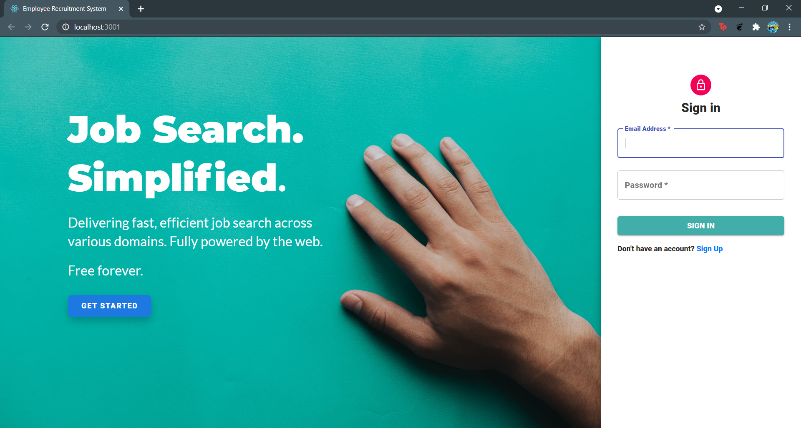
<br /><br />
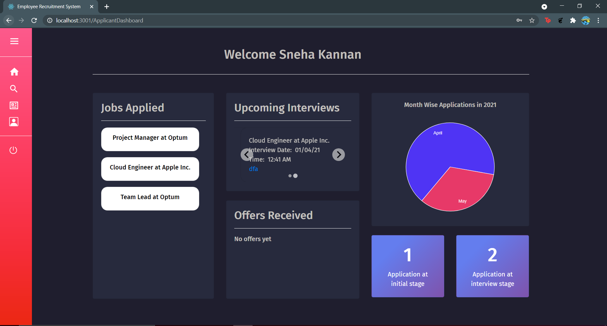
<br /><br />
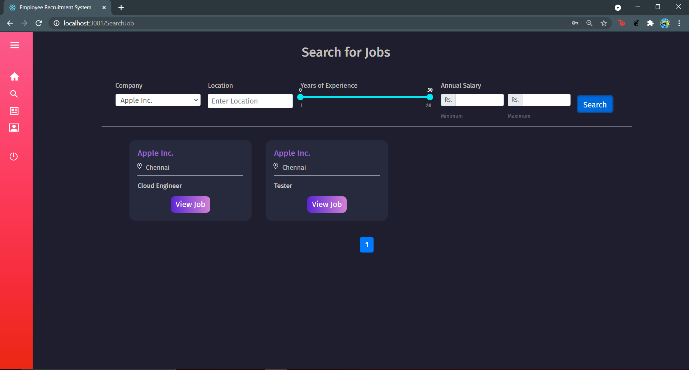
<br /><br />
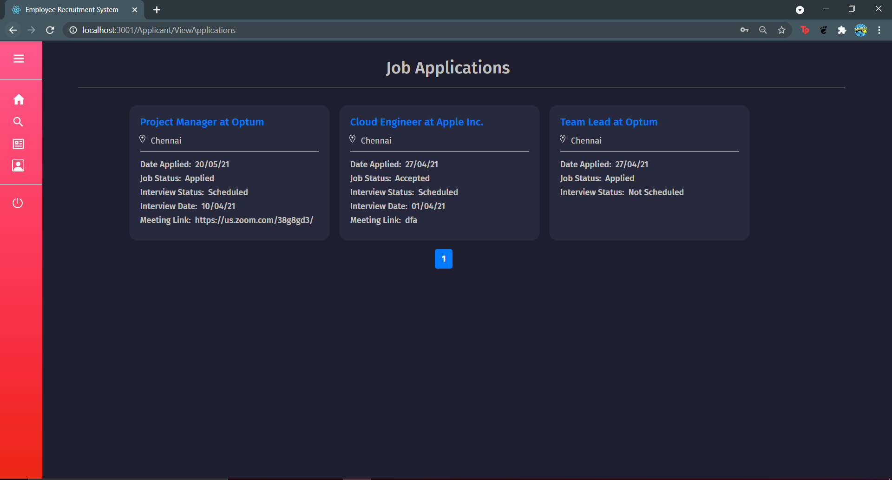
<br /><br />
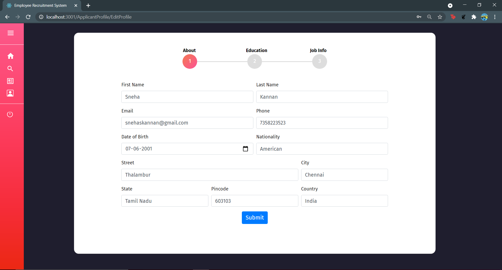
<br /><br />
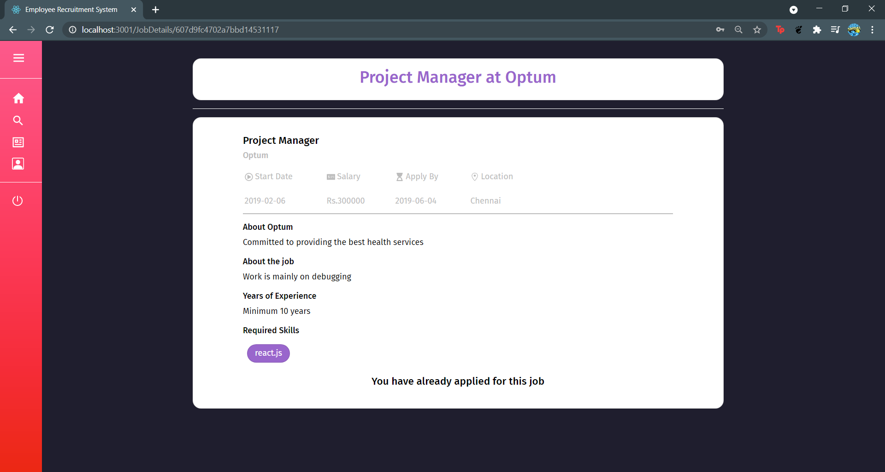

### HR Pages:
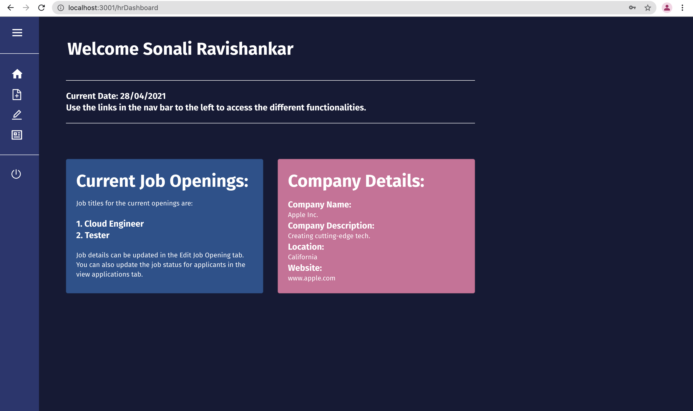
<br /><br />
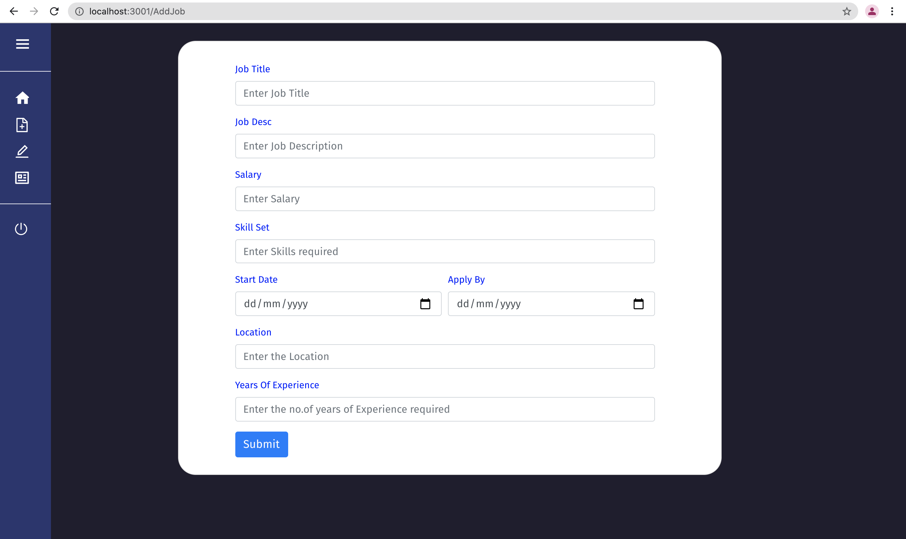
<br /><br />
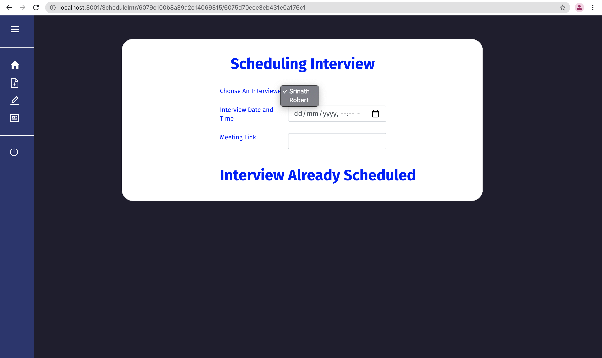

### Interviewer Pages:
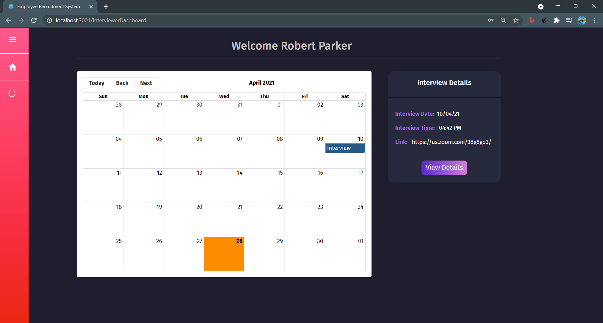
<br /><br />
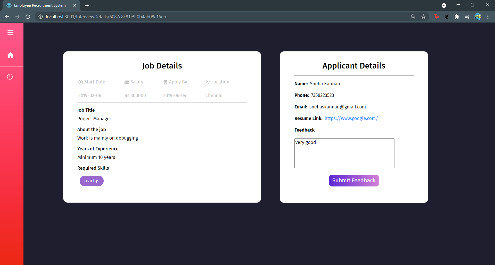

# Employee Recruitment System Backend:
A backend for the Employee Recruitment System written in **TypeScript**. <br /> Uses MongoDB and Express.js. Implemented as a REST API. <br />
Present in the ERSBackend directory.

## To run this:
1. Run ``npm install``.
2. Fill the .env file with the example format given (.env.example).
3. Run ```npm run dev```.

## Design Patterns Implemented (GoF Patterns):

### Creational:

* Singleton Pattern: 
1. ```App``` is a singleton class in our case.
2. Only one instance of this class needs to exist at all times.
```typescript
class App {

    public static instance: App | null = null;
    ... // Other members.
    /**
     * Static method to obtain the singleton instance of the App.
     * @returns {App}
     */
    public static getInstance(): App {
        if (!App.instance) App.instance = new App();
        return App.instance;
    }
    ... // Other methods.
}

// server.ts code
const app: App = App.getInstance();
app.setupServer(
    ... // Method calls.
);
```

### Structural: 

* Façade Pattern: 
1. ```ControllerManager``` provides a single interface for the user who wants to run this server. 
2. Programmers creating controllers do not need to modify server setup code to integrate these new controllers each time.
```typescript
class ControllerManager {

    private _controllerList: Controller[];
    constructor() {
        this._controllerList = [
            new ProfileController(),
            new LoginController(),
            new AdminController(),
            new ApplicantController(),
            new JobController(),
            new InterviewController(),
        ];
    }
    /**
     * Get the list of controller objects to pass to the server.
     * @return {Controller[]}
     */
    get controllerList(): Controller[] {
        return this._controllerList;
    }
}

// server.ts code
const controllers: ControllerManager = new ControllerManager();
```

## Insomnia REST environment configuration:

Used the [Insomnia](https://insomnia.rest/) REST client to test out the backend calls, created test suites that test out all cases for each call, such as invalid input formats, different response codes etc.

```JSON
{
    "scheme": "http",
    "base_path": "",
    "host": "localhost:3000",
    "UserID": "6075556c1353c21a0c0b6b63",
    "ApplicantID": "6079c100b8a39a2c14069315",
    "JobID": "6075d70eee3eb431e0a176c1",
    "CompanyID": "607466022416d60264da43b2",
    "InterviewerID": "6075556c1353c21a0c0b6b63"
}
```
